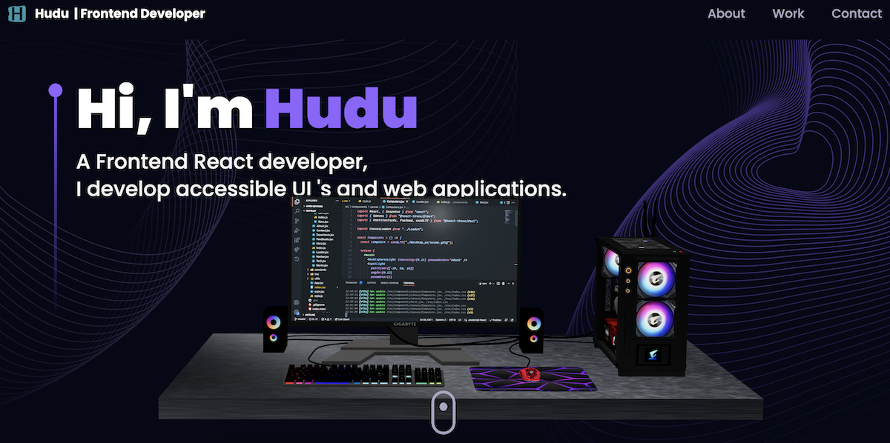
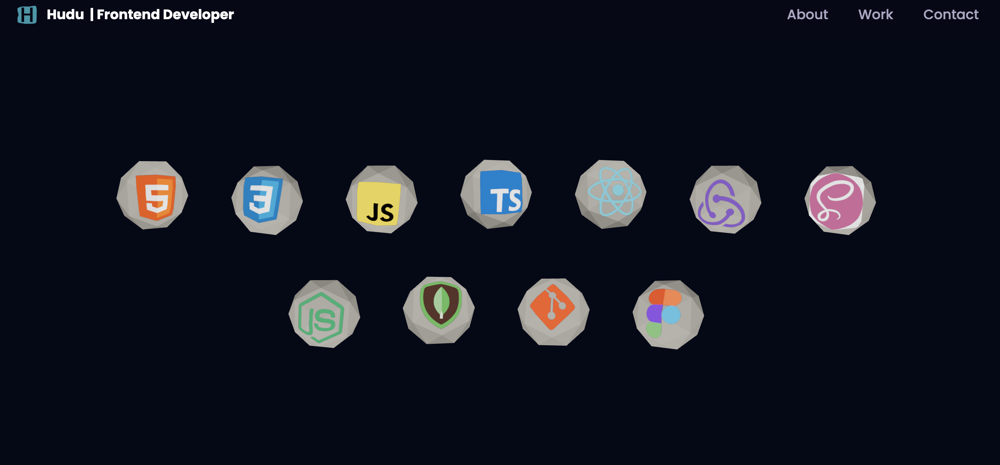
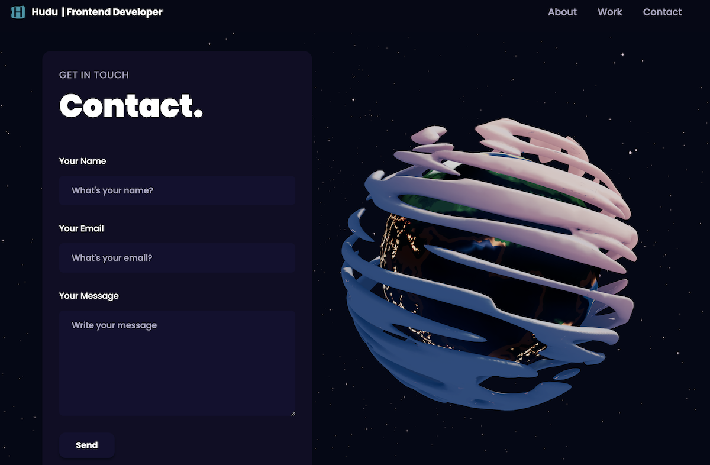

# 3D Portfolio website
 A 3d fully animated portfoliO website built with react/vite, javascript,three.js, HTML/CSS to showcase my skills and experience in web development and web technologies.

 # Motive
 A scalable and surreal web app carefully crafted with details, an eye catching UI with smooth user experience that I got inspired by Adian of Jsmastery.

 # Build status
 Completed buiding the app, ready to be deployed for production and now on hosting stage.

 # Code style
 React component based method, folderize naming conventions and camelCase system of naming.
 Componization of code, DRY principle and inline css styling( tailwind css).

 # screenshots
 
 
 

 # Framework used/Stacks
 * React + Vite
    * Javascript
    * Three.js
    * Tailwind css
    * HTML

# Installation
Open project and npm run dev
Command + click on local url link to access the web page.

# Credits
This 3D portfolio was inspired by Adrian of Javascriptmastery.

